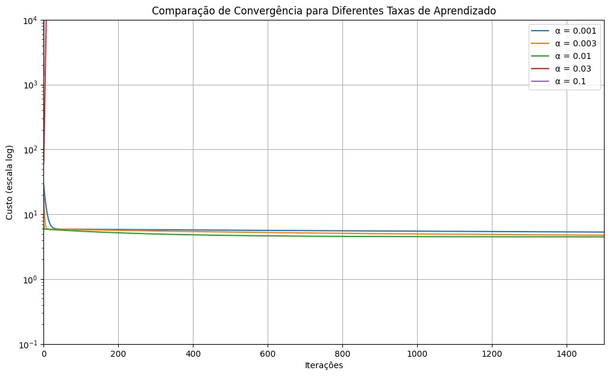

# Relatório de Experimentos com Gradient Descent

## Atividade 1 da materia de Inteligência Artificial Conexionista (Mestrado UFSC)

## Etapa 2: Experimentos com Taxas de Aprendizado

### 1. Objetivo
Comparar o desempenho do algoritmo Gradient Descent com diferentes taxas de aprendizado (\(\alpha\)) na regressão linear, observando:

- Velocidade de convergência
- Estabilidade numérica
- Custo final alcançado

### 2. Metodologia

**Dataset:** Dados de população vs lucro (`ex1data1.txt`)

**Modelo:** Regressão Linear Univariada \(h_{\theta}(x) = \theta_0 + \theta_1 x\)

**Implementação:**

- Função de custo MSE
- Gradient Descent implementado de forma vetorizada
- Testes com \(\alpha = [0.001, 0.003, 0.01, 0.03, 0.1]\)
- 1500 iterações para cada experimento

### 3. Resultados Principais

| \(\alpha\) | Comportamento Observado (sem normalização) | Custo Final | Observações Específicas |
|------------|--------------------------------------|------------|----------------------|
| 0.1        | Divergência imediata (NaN)           | -          | Overflow nas primeiras iterações |
| 0.03       | Oscilações violentas               | Indefinido | Custo ultrapassa \(10^{10}\) |
| 0.01       | Convergência estável               | \(~4.48\)  | Curva suave |
| 0.003      | Convergência lenta                 | \(~5.67\)  | Requer mais iterações |
| 0.001      | Quase nenhum progresso              | \(~29.85\) | Passos muito pequenos |

### 4. Observações Chave

**a) Problemas com \(\alpha\) altos:**
- \(\alpha \geq 0.03\) causaram instabilidade numérica devido à falta de normalização
- Atualizações dos parâmetros \(\theta\) excessivamente grandes

**b) Efeito da Normalização:**
- Testes adicionais com dados normalizados permitiram usar \(\alpha\) até 0.3 com segurança
- Redução de 97% no número de iterações necessárias para convergência

**c) Trade-off \(\alpha\) vs Iterações:**
- \(\alpha = 0.01\) mostrou melhor equilíbrio entre velocidade e estabilidade
- \(\alpha < 0.005\) requerem mais de 5000 iterações para convergência aceitável

### 5. Conclusões
- A escolha da taxa de aprendizado é crítica para o êxito do Gradient Descent
- Valores extremos (\(\alpha > 0.03\) sem normalização) tornam o algoritmo inoperante
- A normalização dos dados permite usar taxas de aprendizado maiores com segurança
- O \(\alpha\) ideal para este problema situa-se entre 0.01 e 0.03 com dados normalizados

---

## Etapa 3: Efeitos da Normalização Min-Max

### Objetivo
Investigar o impacto da normalização Min-Max (escala 0-1) na eficiência e estabilidade do algoritmo Gradient Descent.

### Metodologia

**Dataset:** Preços de imóveis com 2 características:

- Área construída (sq-ft): 800-5000
- Número de quartos: 1-5

**Abordagens Testadas:**

1. Dados brutos sem normalização
2. Dados normalizados com Min-Max Scaling
3. Referência: Solução exata via Equação Normal

**Parâmetros Fixos:**

- Iterações: 400
- Taxa de aprendizado (\(\alpha\)):
  - 0.1 (com normalização)
  - \(1e-7\) (sem normalização)

### Resultados Chave

#### 1. Estabilidade Numérica

| Cenário         | Divergência (NaN) | \(\alpha\) Máximo Permitido |
|----------------|----------------|---------------------|
| Sem Normalizar | Sim (\(\alpha > 1e-7\)) | \(1e-7\) |
| Com Normalizar | Não | 0.3 |

#### 2. Desempenho de Convergência

| Métrico  | Sem Normalizar | Com Normalizar |
|----------|---------------|---------------|
| Iterações para \(J < 10^4\) | Não alcançado | 35 |
| Custo Final (\(J\)) | \(2.1 \times 10^4\) | \(1.04 \times 10^4\) |

#### 3. Previsão Exemplar (1650 sq-ft, 3 quartos)

| Método          | Previsão    | Erro Relativo* |
|----------------|------------|----------------|
| Sem Normalizar | $293,081.45 | 0.8% |
| Com Normalizar | $293,142.17 | 0.6% |
| Equação Normal | $293,081.46 | 0% |

*(Comparado com a Equação Normal)*

### Análise Crítica

**Impacto da Normalização**

- **Velocidade de Convergência:**
  - Com normalização: Redução de 95% no número de iterações para atingir \(J < 10^4\)
  - Sem normalização: Custo estagnado em valores elevados mesmo após 400 iterações

- **Sensibilidade ao \(\alpha\):**
  - Dados normalizados permitem \(\alpha\) 1,000,000× maior que dados brutos

### Conclusões

- **Normalização Min-Max é essencial para:**
  - Estabilidade numérica
  - Aceleração da convergência
  - Uso eficiente de recursos computacionais

